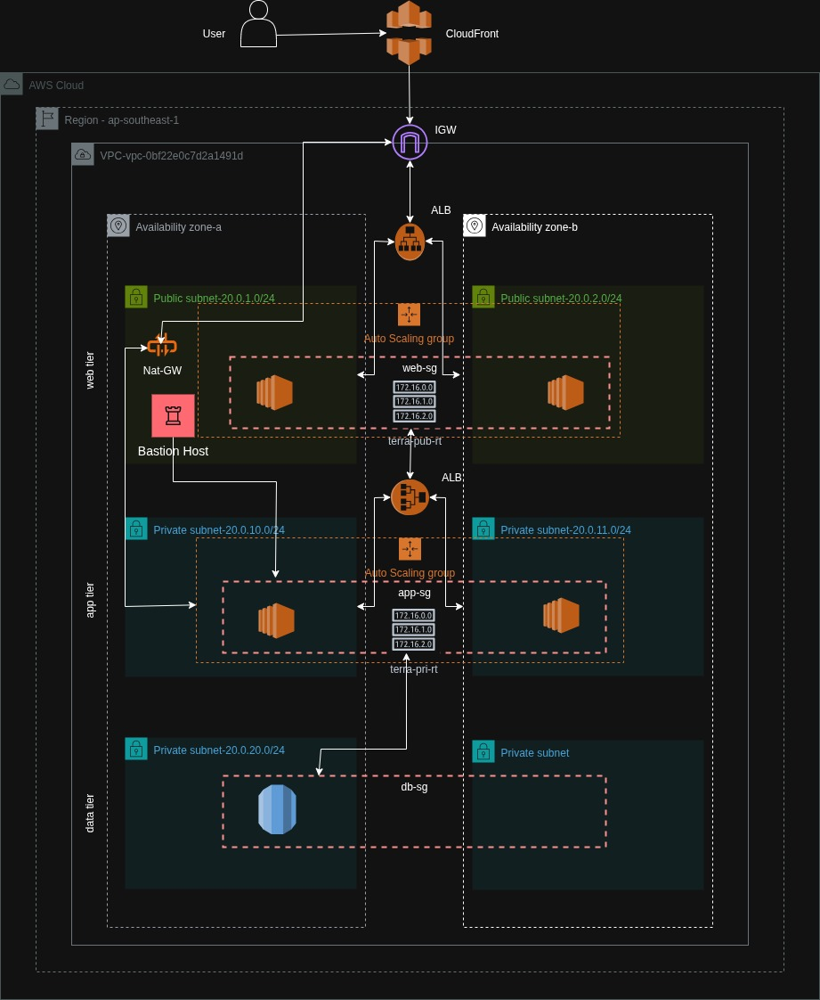
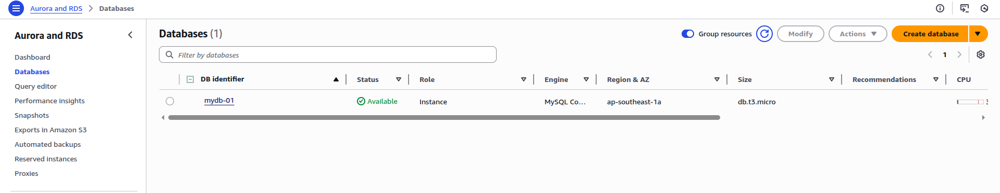

# Architecture








## Clone this repo
```sh
git clone https://github.com/soe-wai-lin/3tier-cf-vpc.git

cd 3tier-cf-vpc

terraform init

terraform plan

terraform apply -auto-approve

```
## Note
In my case, I use key pair name "phue". In your testing environment, you need to change your key pair name.

## Connection test from App server to DB
```sh

mysql -h YOUR_DB_ENDPOINT -P 3306 -u admin -p

```

### THANK YOU !! 
